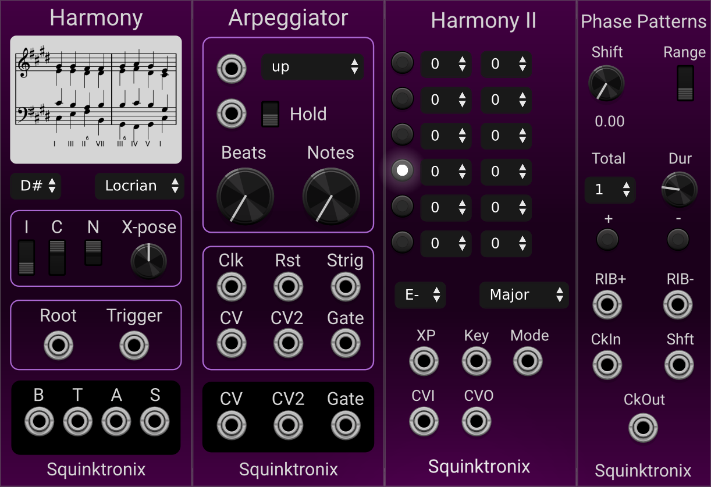

# SqHarmony

There are thee VCV modules here:

[Harmony](./docs/harmony.md) is an "intelligent" chord generator. It is near to being released

[Arpeggiator](./docs/arpeggiator.md) is an Arpeggiator with a lot of features. It also also nearly ready for release

[Phase Patterns](./docs/phasepatterns.md) is a clock delay unit, with a delay ramp easily accessible. [ Currently still in test]/

Follow the links, above, to learn more about each module.

