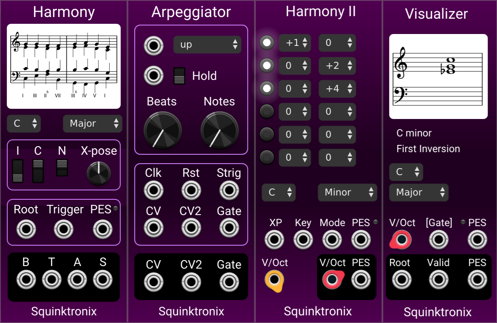

# SqHarmony

There are two unfinished modules here:

[Harmony](./docs/harmony.md) is an "intelligent" chord generator.

[Arpeggiator](./docs/arpeggiator.md) is an Arpeggiator with a lot of features.

Note that this repo does not contain a license allowing redistribution or copying.

