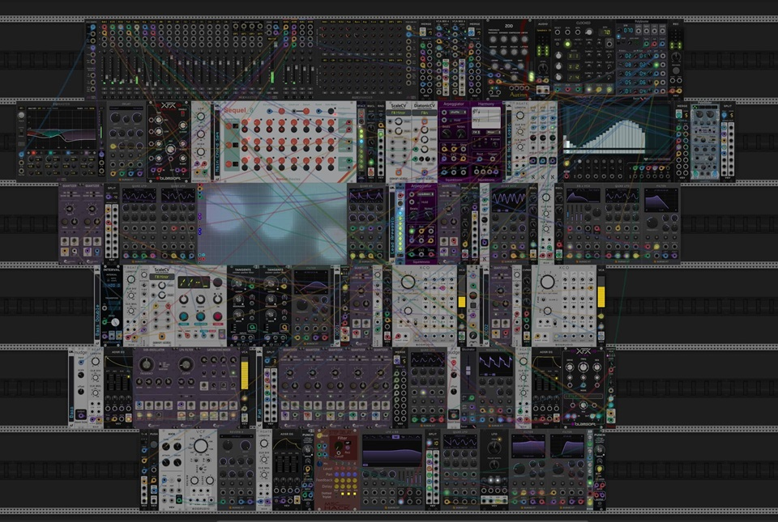

# ArpHarmony Challenge (March 2024)

On 3/3/2024 VCV user Alphagem-O launched a challenge for users to create patches that used both Harmony and Apreggiator, and to limit their submissions to free modules. The [original post and submissions](https://community.vcvrack.com/t/arpharmony-challenge-march-2024/21722) are on the VCV Community site.

The submissions were all quite interesting, so I am copying links here. I will attempt to present all the submissions in the order they were submitted.

Note that I have reduced the resolution of some images. The full res versions can be found in the original post.

Note 2: If you click on some of the links (like the .vcv links) they may open up in github. If you want to download them, right click and download.

## k-chaffin entry

"This is a “duet” between my Meander module and the Squintronix Harmony and Arpeggiator modules. Meander provides the chord progression and various rhythms as well as playing an accompanying melody and arp in the same key as Harmony and Arpeggiator. Meander provides the progression chords root to Harmony. Arp provides an arpeggiation of the Harmony 4 voice chords. There is a lot of parameter automation going on for Meander. This is in A-maj (Ionian) and is a traditional 12 bar blues progression. BASICally provides two scripts to translate between Meander mode and root and Harmony mode and root so that Harmony plays in the same key a the Meander."

Submitted screen shot:

Link to a [soundcloud recording](https://soundcloud.com/cyberpunken/squinktronix-arpharmony-challenge-blues)

[VCV patch file](./Squinktronix%20ArpHarmony%20Challenge%20Blues.vcv)

## Luca Feelgood entry

(VCV user @Luca-Feelgood)

"Ok here is my small contribution for the ArpHarmony March 2024 Challenge. The sequence is called “Finnish Ruisleipä”, which literally means “Finnish rye bread”. I think the sequence is pretty dry. That’s why the name. BTW…Squinktronix Plugs" are pretty neat and I use them a lot when it comes to arpeggio stuff. It actually took me a long time to get these plugins to work for me. But that was another highlight.

To start this Patch.

Hit Spacebar to reset all the stuff. Click on the Master fader. 8Face has 8 snapshots 1 to 8 For me I Start with 2,3,4,5,6,7,8 (from Top to down) This is just for to mix the faders."

[Patchstorage link](https://patchstorage.com/arpharmony-march-2024/)

YouTube link :

[VCV patch file](./Finnish%20Ruisleipä.vcv)

## kinseydulcet entry

"This is an ambient composition using VCV Rack created for the March 2024 ArpHarmony Challenge on the VCV Rack forums. Tides come in and go out. I’m new to VCV Rack but have been enjoying my time with it a great deal given the endless possibilities. Enjoy!"

[Patchstorage link](https://patchstorage.com/oceanic-refrains/)

 

## Alphagem-O entry

"Tried to do something slightly different here: The notes of one of the arps are translated into gates for a tabla (Tala, Seaside Modular) and routed to different sounds depending on their pitch. This was accomplished using a simple comparison script for BASICally (Stochastic Telegraph). The rhythm periodically changes randomly (NoteSeq16, JW) and also is different every time the patch is run, so it becomes a syncopated, polyrhythmic-ish, electroautomatic improvisation dispersed in the luminiferous aether of the unknown, LOL.

Other rhythmic elements emerge from the Euclidian sequencers Eugene and Polygene (both Rare Breeds). A lead, pad, kick and washy snare fill empty spaces.

RGATE (Bogaudio) is guided by 8Face (stoermelder) to change clock divisions, selectively speeding up or slowing down the tempo. Arranged using ShapeMaster (MindMeld)."

YouTube link:

## stewart entry

"Great challenge for me as I have had a lot of fun trying these two out. Thanks for the work you’ve put in. This piece for the Squinktronix ArpHarmony challenge uses four voices each linked via an Arpeggiator or Harmony module. Each occupies a separate row in the patch.

1. Arpeggiator working with 8 random pitches from 8vert with the arpeggio direction/order determined randomly from six.
2. Harmony generates a four part chord per note of the arpeggio.
3. Harmony do the same but less frequently
4. Arpeggiator working with the chord from the Harmony row 3.

I was very interested to explore the harmony of Harmony contrasted again the un quantized input. The STRIP module from stoermelder is such a handy module for the randomizing. I also use it a couple of times to turn off the 8vert. Harmony does a return to smooth harmony beautifully when that happens. I’d never come across either module so thanks for the challenge poking me in the right place! I hope you enjoy the results."

YouTube link:

[Patchstorage link](https://patchstorage.com/un-tuned-arpharmony-challenge-march-2024/)

## Urs Basteck entry

VCV username purs

"Sneak peek :slight_smile:"

## Matthew Paine entry

VCV username Matthew_Paine_Music

"Here is my submission to the March challenge. It’s a subtle one. I love how much action this challenge is getting. Great job @Alphagem-O.

* The Squonk Sequencer randomly selects root note Harmony modules.
* The Harmony modules are set at different keys and being cycled through randomly at different rhythmic values to create a mix of diatonic and chromatic chord progressions.
* Each voice has its own oscillator and Chance module before its envelope trigger. This randomly breaks up the voices of the chords and creates a lot of space as it is common for few or no voices of the chord to be triggered.
* The Harmony module sequence can be over ridden by hitting the BIG BUTTON. Now each voice is randomly selecting any of the harmony module creating random harmonies. I love this feature! The harmony will snap back to using one Harmony module at a time by hitting the BIG BUTTON again.
* The rhythmic rate of change of each chord is reasonably steady at 50% chance of changing at of the same rate as the Harmony model changes.
* This rate of change is be periodically overridden with a barrage of fast changing chords via the Trigger input.
* The Arpeggiator modules are being used in a traditional way (though the manual points out some awesome non conventional uses). 4 voice and 3 voice groups are being randomly switched between with random rhythmic values and let through in random bursts. The other arp feature is creating harmonised arp’s by using 2 voices groups of each chord. I have created 2 different 2 voices group that are randomly being switched between.
* The 2 Arp chains described above are also being randomly switched between. This was a cheeky way of having both features but only taking up one overall voice in order to keep within the max 5 voices count of the challenge.
* A late addition to the patch was the removal of the soprano voice and replaced with slow sounding arpeggiator plodding along through the piece."

YouTube link:

[Patch file](./ArpHarmony_March%20challenge_Matthew%20Paine.vcv)

## baconpaul entry

"Sure I’ll give it a whirl. Cool modules @Squinky"

YouTube link:

[Patchstorage link](https://patchstorage.com/surge-squinty/)

## waldo entry

"My lil noodle to add here."

YouTube link:

[Patchstorage link](https://patchstorage.com/arpharmony-march2024//)

## helk.lasschuit entry

"So I got this idea: what would happen if you just cascaded Harmony and Arpeggiator? You know: feed 0V into Harmony, feed the chord into Arpeggiator, feed the arpeggio into Harmony and the chord again into Arpeggiator while multiplying the tempo 8x etc. And out of nothing there arises a nice harmonic development…"

[Video Link](https://rankett.net/w/9ubKuRDEcjsude9bSgw6MR)

[Patchstorage link](https://patchstorage.com/arpharmonychallengemarch2024/)