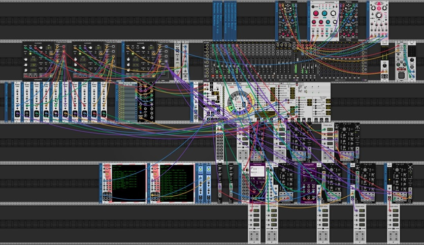

# ParpHarmony Challenge (March 2024)

On 3/3/2024 VCV user Alphagem-O launched a challenge for users to create patches that used both Harmony and Apreggiator, and to limit their submissions to free modules. The [original post and submissions](https://community.vcvrack.com/t/arpharmony-challenge-march-2024/21722) are on the VCV Community site.

The submissions were all quite interesting, so I am copying links here. I will attempt to present all the submissions in the order they were submitted.

Note that I have reduced the resolution of some images. The full res versions can be found in the original post.

Note 2: If you click on some of the links (like the .vcv links) they may open up in github. If you want to download them, right click and download.

## k-chaffin entry

"This is a “duet” between my Meander module and the Squintronix Harmony and Arpeggiator modules. Meander provides the chord progression and various rhythms as well as playing an accompanying melody and arp in the same key as Harmony and Arpeggiator. Meander provides the progression chords root to Harmony. Arp provides an arpeggiation of the Harmony 4 voice chords. There is a lot of parameter automation going on for Meander. This is in A-maj (Ionian) and is a traditional 12 bar blues progression. BASICally provides two scripts to translate between Meander mode and root and Harmony mode and root so that Harmony plays in the same key a the Meander."

Submitted screen shot:

Link to a [soundcloud recording](https://soundcloud.com/cyberpunken/squinktronix-arpharmony-challenge-blues)

[VCV patch file](./Squinktronix%20ArpHarmony%20Challenge%20Blues.vcv)

## Luca Feelgood entry

(VCV user @Luca-Feelgood)

"Ok here is my small contribution for the ArpHarmony March 2024 Challenge. The sequence is called “Finnish Ruisleipä”, which literally means “Finnish rye bread”. I think the sequence is pretty dry. That’s why the name. BTW…Squinktronix Plugs" are pretty neat and I use them a lot when it comes to arpeggio stuff. It actually took me a long time to get these plugins to work for me. But that was another highlight.

To start this Patch.

Hit Spacebar to reset all the stuff. Click on the Master fader. 8Face has 8 snapshots 1 to 8 For me I Start with 2,3,4,5,6,7,8 (from Top to down) This is just for to mix the faders."

[Patchstorage link](https://patchstorage.com/arpharmony-march-2024/)

YouTube link :

[VCV patch file](./Finnish%20Ruisleipä.vcv)

