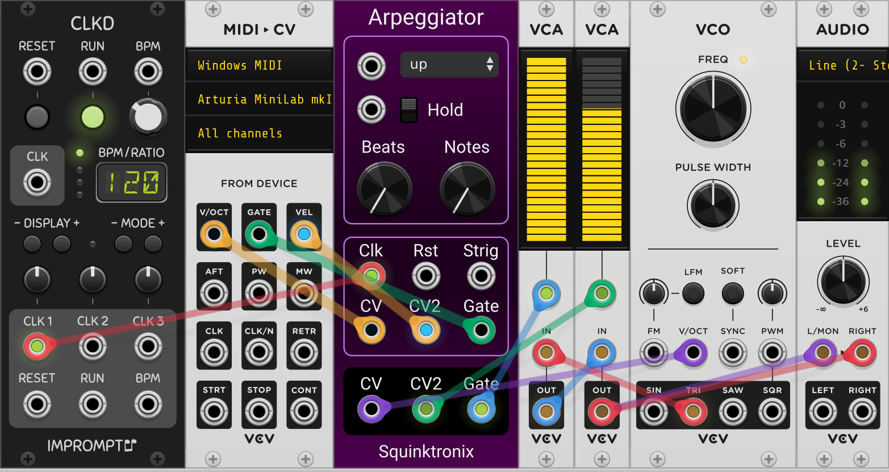

# Squinktronix Arpeggiator manual

We tried to put all the most needed info at the top of this short document, but if you are so inclined you can find some more esoteric, but useful and non-obvious, information at the bottom.

## What it does

It acts like most arpeggiators. All the voltages that come in through the polyphonic V/Oct input are put into a buffer where they are played over and over, every time a clock occurs. The mode control, and other controls, determine in what order the notes are played back.

Sometimes in the manual we will refer to "pitches" and "notes", but the Arpeggiator really just takes in voltages and outputs voltages. There is no quantizer, and the voltages can of course be used for anything you want.

## TLDR

A very basic application is using a keyboard as input, and outputting a pitch to a synth patch. Patch the V/Oct and Gate output of the MIDI-CV module to the Arpeggiator inputs. Hook up an external clock and you are in business. Make sure the polyphony is set to something reasonable (like 4).

Here is a simple working patch:

## The modes

The most dramatic, and also typical control is the **Mode** control. It's the drop-down at the top. The modes are:

* **Up** - the input is played from low to high, over and over.
* **Down** -  the input is played from high to low, over and over.
* **Up+down** - the input is played from low to high, then high to low.
* **Down+up** - the input is played from high to low, then low to high.
* **Up and down** - like up+down, except the highest and lowest are repeated.
* **Down and up** - like down+up, except the highest and lowest are repeated.
* **inside out** - pitches are output highest, lowest, etc., working their way in to the middle. When all have been played it repeats.
* **outside in** - Opposite of inside out. Pitches start in the middle and go outwards, getting alternately higher and lower.
* **order played** - voltages are output in the order they were input.
* **repeat low** - the lowest note is played on all odd outputs, while the other notes are in-between, low to high.
* **repeat high** - the highest note is played on all odd outputs, while the other notes are in-between, low to high.
* **shuffle** - Notes are played in a random order, then when one cycles is done the order is "shuffled" and a new cycle begins. Unlike typical random modes, each value is output once and only once per cycle.

## Controls

* **Arpeggiator Mode** - A drop-down menu will open if you click on this control. This will reveal a menu with all the different arpeggiator modes, explained above. After you select one the menu closes and a shortened version of the mode name is shown (to save space).
* **Hold** - A switch. When Hold is active notes will accumulate in the arpeggiator, and a falling gate will not removed the note. To clear the arpeggiator, turn Hold off and the notes will stop.
* **Length** - Set the size of the input buffer. If length is zero it's not limited, but other settings will only keep that many input notes.
* **Beats** - Sets the playback repetitions. When zero, does nothing. Other settings will determine the perceived number of beats in the output.

**Length** and **Beats** are explained more in the [Rhythm](More-about-rhythms) section.

## Inputs

* **Mode** - Same as the Mode control, but if the Mode CV input is patched it will override the panel control. CV = 0 is the first mode, going up by one mode each 1/12 of a volt.
* **Hold** - Same as the hold control, but if the Hold CV input is patched it will override the panel control.
* **CV** - Pitch input. Polyphonic. All the Channels may feed into the arpeggiator input buffer. This input must be patched to a polyphonic source, or the arpeggiator will not have enough notes to play.
* **CV2** - A second value that will be carried around with CV. Whatever re-ordering and repeaing is applied to CV will also be applied to CV2. Traditionally might be called "velocity input".
* **Gate** - Polyphonic gate input. The module will sample the CV input when any gate goes from low to high. If a mono gate it patched, it will sample all the CV inputs on a low to high transition.
* **Clk** - The master clock input. Notes are played when the clock is high, advancing to the next note on the next low to high clock transition.
* **Rst** - reset input. Resets playback to the first step of the arpeggiator. see [below](#More-about-reset-and-clock)
* **strig** - shuffle trigger input. When patched, arpeggiator will not re-shuffle once it has played all the "notes", but a low to high transition on this input will force a shuffle at the end of the current loop.

## Outputs

* **CV** - Monophonic main output.
* **CV2** - Supplementary CV output.
* **Gate** - Monophonic gate output.

## Context Menu

* **reset mode 2** - When this is off the reset input will use the "standard" reset protocol (high voltage holds arpeggiator in reset). When this is on, will use "Nord" reset. A low to high transition on the reset will "cue up" reset, but the reset will not happen until the next clock".
* **Gate Delay**. Inserts a 5 sample delay in front of the gate input. This helps avoid issue where the CV gets delayed by a couple of sampled because it is patched through some. If it's off, CV is sampled right when the corresponding gate goes high.

## More about rhythms

If Arpeggiator is left at its default settings, and driven with a regular clock, it will want to make the "typical" arpeggiator sound/rhythm that you know and love. But there are many more other possibilities.

One simple thing is to use the output of a trigger sequencer as the clock. Then you can easily substitute any rhythm you like instead of the relentless 80's eighth-notes.

The **Length** and **Beats** controls will also affect the output rhythm.

As and example, let's say you play in <1, 2, 3, 4>.

If Arpeggiator is in **down** mode, then the output will be <4, 3, 2, 1, 4, 3, 2, 1 ...>. Because you played in 4 notes, it will repeat every 4, and sound like a 4/4 rhythm.

It you change the **Beats** to 7 the same input will give <4, 3, 2, 1, 4, 3, 2> which would most likely sound like a 7/8 rhythm.

If the input is longer than the **Beats** setting, then only the first notes will play. Same input, Beats 2 will give <4, 3, 2, 4, 3, 2, ...>, and the 1 will never play (unless the settings are changed).

**Length** can be similar to **Beats**, but it isn't. **Length** determines how many notes Arpeggiator will hold onto. For example, if **mode** is **up** and **Length** is three you play: <1, 2, 3, 4, 5> you will get out \<\3, 4, 5, 3, 4, 5> because 3, 4, and 5 were the last three notes entered. Then if you play <6>, you will get <4, 5, 6, ...> as 4, 5, and 6 are the last three.

The Length setting can really be useful when the hold switch is on.

And, remember, when length is at its default, "0", it is really something very large, like 32. or "unlimited".

## More about reset and clock
