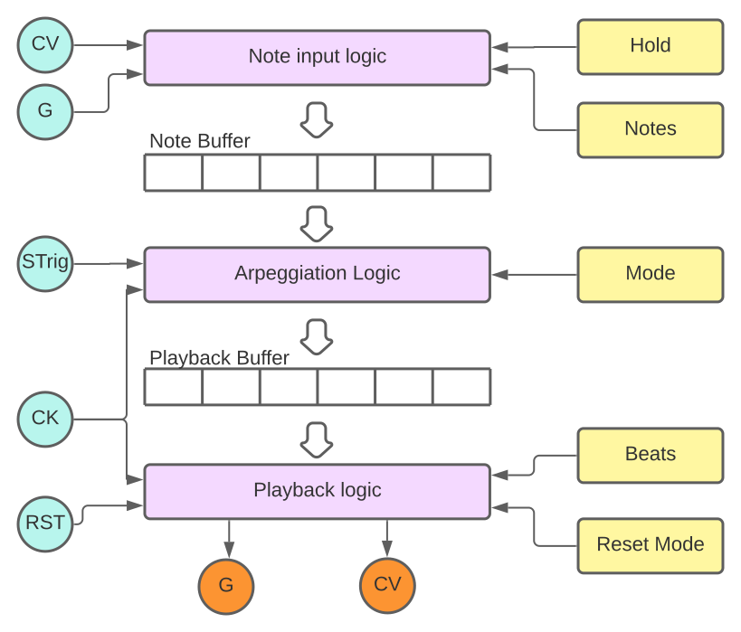

# Squinktronix Arpeggiator manual

We tried to put all the most needed info at the top of this short document, but if you are so inclined you can find some more esoteric, but useful and non-obvious information at the bottom.

## What it does

It acts like most arpeggiators. All the voltages that come in through the polyphonic CV inputs are put into a buffer where they are played over and over, every time a clock occurs. The mode control, and other controls, determine in what order the notes/voltages are played back.

Sometimes in the manual we will refer to "pitches" and "notes", but the Arpeggiator really just takes in voltages and outputs voltages. There is no quantizer, and the voltages can of course be used for anything you want.

There are many cool ways to use Arpeggiator for other purposes. If all the inputs come from some place other than the MIDI input Arpeggiator begins to act more like a sequencer, or other algorithmic "thing". It is quite easy and fun to use this module for things that don't sound like notes in a chord played over and over.

If the hold mode is enabled, and the length set low (like 8) is acts more like a shift-register than an arpeggiator. For one simple example.

## TL;DR

A very basic application is using a keyboard as input, and outputting a pitch to a synth patch. Patch the V/Oct and Gate output of the MIDI-CV module to the Arpeggiator inputs. Hook up an external clock and you are in business. Make sure the polyphony is set to something reasonable (like 4).

Here is a simple working patch. In this example we went for the super cliché, and used CV2 for keyboard velocity, and routed this to a simple VCA to control the volume from the velocity.

## The modes

The most dramatic, and also typical control is the **Mode** control. But there are some pretty unusual and good sounding modes at the bottom of the list. Mode is the drop-down at the top. The modes are:

* **up** - the input is played from low to high, over and over.
* **down** -  the input is played from high to low, over and over.
* **up+down** - the input is played from low to high, then back down.
* **down+up** - the input is played from high to low, then back down.
* **up and down** - like up+down, except the highest and lowest are repeated.
* **down and up** - like down+up, except the highest and lowest are repeated.
* **inside out** - pitches are output highest, lowest, etc., working their way in to the middle. When all have been played it repeats.
* **outside in** - opposite of inside out. Pitches start in the middle and go outwards, getting alternately higher and lower.
* **order played** - voltages are output in the order they were input.
* **repeat low** - the lowest note is played on all odd outputs, while the other notes are in-between, low to high.
* **repeat high** - the highest note is played on all odd outputs, while the other notes are in-between, low to high.
* **shuffle** - Notes are played in a random order, then when one cycles is done the order is "shuffled" and a new cycle begins. Unlike typical random modes, each value is output once and only once per cycle.

## Controls

* **Arpeggiator Mode** - A drop-down menu will open if you click on this control. This will reveal a menu with all the different arpeggiator modes, explained above. After you select one the menu closes and a shortened version of the mode name is shown (to save space).
* **Hold** - A switch. When Hold is active notes will accumulate in the arpeggiator, and a falling gate will not remove the note. To clear the arpeggiator, turn *Hold* off and the notes will stop.
* **Beats** - Sets the playback repetitions. When zero, does nothing. Other settings will determine the perceived number of beats in the output.
* **Notes** - Sets the size of the input buffer. If the Notes knob is all way left, it's not limited (actually limited to 32) but other settings will only keep that many input samples.

**Beats** and **Notes** are explained more in the [Rhythm](#more-about-rhythms) section.

## Inputs

* **Mode** - Same as the Mode control, but if the Mode CV input is patched it will override the panel control. CV = 0 is the first mode, going up by one mode each 1/12 of a volt.
* **Hold** - Same as the hold control, but if the Hold CV input is patched it will override the panel control. 0V or less is off, over 5V is on.
* **CV** - Pitch input. Polyphonic. All the Channels may feed into the arpeggiator input buffer. This input must be patched to a polyphonic source, or the arpeggiator will not have enough notes to play (unless you use Hold).
* **CV2** - A second value that will be carried around with CV. Whatever re-ordering and repeating is applied to CV will also be applied to CV2. Traditionally might be called "velocity input".
* **Gate** - Gate input, often polyphonic. The module will sample the CV input when any gate goes from low to high. If a mono gate is patched, it will sample all the CV inputs on a low to high transition.
* **Clk** - The master clock input. Notes are played when the clock is high, advancing to the next note on the next low to high clock transition.
* **Rst** - reset input. Resets playback to the first step of the arpeggiator. see [below](#more-about-reset-and-clock).
* **Strig** - shuffle trigger input. When patched, arpeggiator will not re-shuffle once it has played all the "notes", but a low to high transition on this input will force a shuffle at the end of the current loop.

## Outputs

* **CV** - Monophonic main output.
* **CV2** - Supplementary CV output.
* **Gate** - Monophonic gate output.

## Voltage Levels

All on/off inputs, like Gate, Clock, Reset, etc... are schmidt triggers with hysteresis to clean up the input. They turn on when the input goes above 1.0 volts, and turn off when the voltage goes below .1 volts, as per the VCV standard. All on/off outputs are 0 when off and 10 when on.

## Context Menu

* **Reset mode II** - When this is off the reset input will use the "standard" reset protocol (high voltage holds arpeggiator in reset). When this is on, will use "Nord" reset. A low to high transition on the reset will "cue up" reset, but the reset will not happen until the next clock. The next clock will not be treated as a clock signal.
* **Gate+Clock Delay**. Inserts a 5 sample delay in front of the gate input, and a 10 sample delay in front of the clock. This helps avoid issue where the CV gets delayed by a couple of samples because it is patched through some module. If it's off, CV is sampled right when the corresponding gate goes high.

Gate+Clock Delay can also help in patches that don't use a keyboard, but instead click in pitches under clock control.

## More about rhythms

If Arpeggiator is left at its default settings, and driven with a regular clock, it will want to make the "typical" arpeggiator sound/rhythm that you know and love. But there are many more other possibilities.

One simple thing is to use the output of a trigger sequencer as the clock. Then you can easily substitute any rhythm you like instead of the relentless 80's eighth-notes.

Arpeggiator output gate follows the clock input exactly if there are any notes to play. So the width of the clock input will control how long the note stays on. A narrow clock will make staccato output, whereas a wide clock will make a more legato output. Many clock generators allow you to adjust this.

The **Notes** and **Beats** controls will also affect the output rhythm.

As an example, let's say you play in <1, 2, 3, 4>.

If Arpeggiator is in **down** mode, then the output will be <4, 3, 2, 1, 4, 3, 2, 1 ...>. Because you played in 4 notes, it will repeat every 4, and sound like a 4/4 rhythm.

It you change the **Beats** to 7 the same input will give <4, 3, 2, 1, 4, 3, 2> which would most likely sound like a 7/8 rhythm.

If the input is longer than the **Beats** setting, then only the first notes will play. Same input, Beats 3 will give <4, 3, 2, 4, 3, 2, ...>, and the 1 will never play (unless the settings are changed).

**Notes** can be similar to **Beats**, but it isn't. **Notes** determines how many notes Arpeggiator will hold onto. For example, if **mode** is **up** and **Notes** is three you play: <1, 2, 3, 4, 5> you will get out \<3, 4, 5, 3, 4, 5> because 3, 4, and 5 were the last three notes entered. Then if you play <6>, you will get <4, 5, 6, ...> as 4, 5, and 6 are the last three.

The Notes setting can really be useful when the hold switch is on. When hold is on, all the notes you enter are accumulated, up to the last 32 notes. If you set length to a lower number 'n', only the last 'n' notes will be held.

And, remember, when length is at its far left (counter clockwise) "zero" setting, it is really something very large, like 32.

## More about clock and gate delay

Many modules have a "gate delay" feature. Often it's on by default. Consider this case:

* A "synth" module will "play" a note when the gate goes high.
* For some synths, the pitch CV is only sampled when the note starts (when the gate goes high).
* Gate and CV will both change on the same sample at the output of the MIDI-CV module.
* It the user patches something to modify the pitch, like the VCV Octave module, it sill add a one sample delay to the pitch CV.

In this case the correct pitch comes in one sample after the gate. So a synth module like this would capture then wrong CV, and the user would need to a) realize this, and b) find a one sample delay and patch that into the gate signal to equalize the delays.

So we (and others) build a delay into our modules to delay the gate, and avoid these issues. A fixed delay of 5 samples is perfect. Undetectable, but will cover many patching delays.

With Arpeggiator it's a little more complicated. Arpeggiator does sample the input pitch when the gate goes high, but it plays notes to its output when the clock input rises. So there are several ways that Arpeggiator could output the "wrong" thing if there are any delays between the CV, Gate, and Clock.

For this reason, Arpeggiator has "Gate+Clock Delay". What this does is delay the gate input by 5 sample, but also delays the clock input by 10 samples. This will tend to correct for any mismatched delays between the three signals.

Because this is a new feature, it is off by default in Arpeggiator. But if anything wonky happens, turn it on. It may fix it and is unlikely to hurt anything.

## More about reset and clock

Depending on your settings, clock and reset will interact. In VCV the behavior or reset has always been a source of controversy and improper operation.

Arpeggiator supports two different "standards", *classic* reset and *Nord* reset. In the context menu this is "Reset mode II" (on/off). Reset mode II is Nord reset, when it is on, and classic reset when it is off.

In classic reset, reset happens as soon as the reset line goes high. Any clocks that come in then or within one millisecond are ignored. The implementation in Arpeggiator only resets on the initial edge of the reset line, holding reset high will not keep Arpeggiator in reset (although maybe it should).

In "Reset mode II", the low to high transition of the reset line does not cause an immediate reset. Instead, a reset is queued up, but does not execute until the next clock. This way, reset is perfectly synchronized with the clock, and there is no ambiguity about which clocks should be honored or ignored. No clocks are ignored in this mode, except of course the clock that is acting as a reset.

This reset mode is often called "Nord mode" because it is how the original Nord Modular synth handled reset.

## Block diagram

Aside from being nice looking, it may help understand what's going on. For one thing, you can see that the note buffer holds all the recent notes/voltages that were input. And that input of data is controlled only by CV and Gate. That is all totally independent of the arpeggiation, which is applied as data is copied from the note buffer to the playback buffer. There data is played over and over until something happens to make Arpeggiator copy from the note buffer again.

You can also see the reset logic only resets the playback buffer, it does not effect the note buffer.

