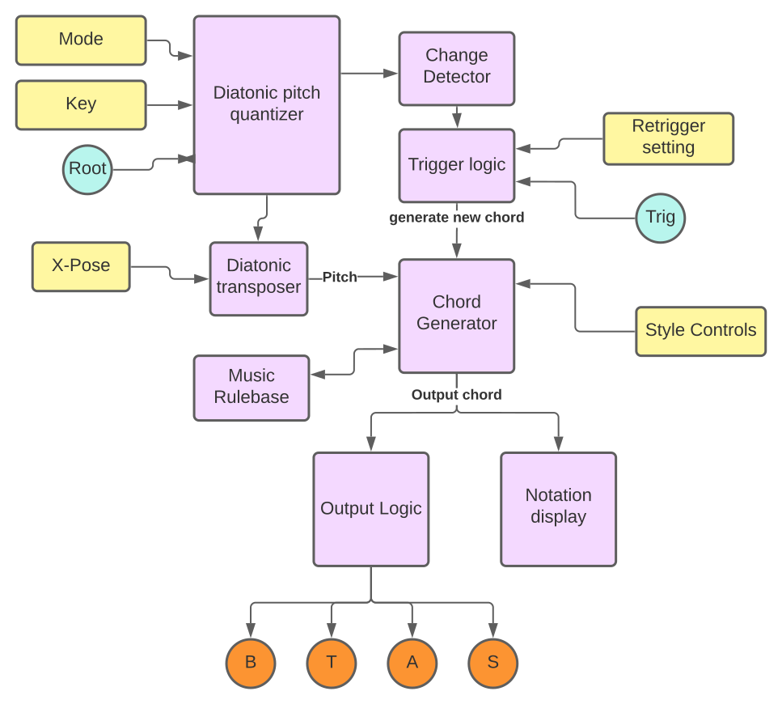

# Squinktronix Harmony manual

There are a lot of chord generators out there, but not many that can pick an optimal inversion and voicing to connect with the previous chords.

Harmony is a very simple module (on the outside). It takes a single input of a root pitch, and outputs a four part harmony. Harmony attempts to link chords together using the common practice rules for voice leading, as described in Walter Piston's classic text "Harmony".  

If the output is used to play a four voice polyphonic synth patch, it will sound more or less like "music from right before Bach". You don't need to know anything about music theory to use it, however.

You may select keys, and there is some control of the chords that will be generated, but always withing the rules of good harmony and voice leading.

## Panel

### The score at the top

This displays the last bar or two of generated chords. It is purely visual candy. If you don't read music, don't worry about it.

All durations are notated as quarter notes. The module has no conception of "time", so this is completely arbitrary. I like the way notes look with stems, so that's what I did. Also, having stems means that it is easy to keep the four generated voices straight. The bass clef has the bass voice with stems down and the tenor voice with the stems up. The treble clef has the alto voice with the stems down and the soprano voice with the stems up.

Because the chords generated by Harmony are fairly "simple", the notation often comes out looking pretty good. But there are probably ways to make the stems run into each other or something else bad.

The score should have a correct key signature on the left. You can't control whether it will display sharps or flats, but they should be correct.

### The inputs

There is a single CV input. It's monophonic, and follows the VCV voltage standards. The input is quantized to the current scale. If the quantized input has changed, new output is generated.

The input is used to determine which chord to generate, 1, 2, 3, 4, 5, 6, or 7. The octave information is ignored. Also ignored are any non-scale notes in the input, they are quantized to the nearest scale note.

There is an optional trigger input. Either the trigger input, or a CV change, or both can trigger the generation of a new chord.

### The outputs

There are four CV outputs. If all four are used they are monophonic, and there is one for each outputs voice: bass, tenor, alto, and soprano.

If all outputs are not patched, then some outputs will be polyphonic. An unpatched output voice will come out the next connected jack. For some simple examples:

* If only the last jack, Soprano, is patched, it will be four voice polyphonic, with Bass on channel 0 up to Soprano on channel 3.
* if the Bass output is not patched, but Tenor is, it will have two channels.

This "1-CV" feature is always on. The number of channels in each output is indicated on the panel.

### The controls

On the top are two controls that let you pick any diatonic mode and root. For example "C Minor" or "A sharp Dorian". Note that you may only specify accidentals as "sharps" even though it might make more sense in some cases to use flats. For example, if you want B flat you must use A#.

See below for more on using non-major modes with Harmony.

There are four controls in the middle that let you control the chords that are generated:

* **Inv Pref** (Inversion Preference) Give some control on whether generated chords will be in root position, or one of the inversions. The default is to discourage two chords in a row to be inverted. Settings are:
  * Discourage consecutive. The default. tries to ensure that for any two chords in sequence, at least one is in root position.
  * Discourage. Harmony will avoid inverted chords, when possible.
  * Don't care. Harmony will pick the chord inversion that follows the most rules.
* **Cent Pref** (Center Preference)
  * None. Allows the full, normal pitch range of all voices in the generated chords.
  * Narrow Range. Limits the pitch range of the four generated voices. Top notes can not go as high, bottom notes can not go as low.
  * Encourage Center. This will try to minimize the distance between the top and bottom of the chord. Will prefer close chords to open chords.
* **NNIC Rule** (No Notes In Common Rule) Enabled and disables to voice leading rule that kicks in when two chords have no common notes between them. This is a fairly strict rule, so turning it off can allow more freedom in the generated chords. The rules that Harmony uses in this case are listed below, with the other rules.
* **Xpose** This transposes the input by a fixed number of scale degrees.

Note: there are a few quantizers that can transpose by scale degrees, but it is far more common for them transpose first by a number of semitones, then quantize the result to a diatonic scale. While this generates notes that are all in the scale, the number of scale degrees will very. So, for example, a lot of "70's rock" bands like to play to dual lead guitar with the two guitarists playing a third apart. This effect is not possible with many quantizers.

The Xpose feature was added partly to address the fact that Harmony will not generate 7th or 9th chords. However you can by using two instances and using the Xpose to offset them.

### The context menu

* Repetition avoidance. When enabled will prevent Harmony from re-using a chord. Most useful in conjunction with the Trig input.
* Black notes on white paper. Will reverse the colors used to draw the score.
* Retrig. on notes and CV. Only has an effect when the Trig input is used. When off, only trig input will generate a new chord, not CV change. Normally on.

## Getting good results

Harmony tries to output decent chord progressions regardless of the input. So may you feed anything into it and get a plausible output. But if you want it to sound "right" to ears from 1700, you need to spend a little care with the input.

For example, you can patch a knob into the CV input, twist the knob, and get out a sequence of chords. But they won't be great sounding. This is because Harmony will see that your are entering a chord progression of 1, 2, 3, 4, 5, 6 etc.. which is not a chord progression that works well with common practice harmony. It is very difficult to connect this "bizarre" chord progression without breaking any rules.

A chord progression of 1-5 is super easy to connect, but 1,2,3,4,5 is very difficult. So try to apply clean, discrete input to Harmony, not slowly changing input. Even if the input moves fast enough that you don't hear 1,2,3,4,5 Harmony heard it and tried to harmonize it. When you settle on the 5 Harmony may have take a tortuous path to get there, and the result won't sound as good as a clean 1-5 input.

The trigger input can be very helpful, as it will act as a sample and hold an only let changes happen on a trigger (assuming Retrig. on notes and CV is off).

Play around with the various front panel controls. Even if you don't understand exactly what they do, you may get pleasing sounds this way.

## Using in "other" modes

All the voice leading rules that Harmony knows are from Major keys. Although Harmony will happily apply these rules to other modes, some are not legit "rule" in other key. Here are some simple examples:

In a major key, the leading tone (major 7) really wants to "resolve" to the tonic. Harmony knows this. But in a minor key Harmony will try just as hard to resolve a minor 7th up to the tonic. Which is fine, but not as necessary. That is why musicians invented the melodic minor scale. Harmony does not understand the melodic minor.

Another example: the triad on the 5th scale degree (the dominant) is a very strong and stable chord in a major key. But in some modes, like Phrygian, the triad on the 5th is a diminished chord, and will have a much different role. Harmony will still think this is a strong chord.

The bottom line: you may get very interesting and useful results with non-major modes. Or they may sound somewhat broken to you. They would for sure sound strange to Bach.

## Using The Trig input and Repetition avoidance

Harmony will normally only generate a new chord when the input changes by at least a half step. But you may want to force it to generate a new chord even when there is no change. Or you may want to prevent excessive chords from being generated from a noisy CV input.

If the Root input stays constant, you use the Trig input to generate more variations on the same chord. For example, if the Root input is E, you will generate an E chord (if the mode you are in includes E). New inputs on the trigger input will cause Harmony to generate more E chords, but with different voicings. This can sound really good against a drone.

Alternatively, the input may be changing too often, or not when you want it to. You often can solve this with an external Sample and Hold, but you can also use the Trig input. Make sure _retrig on notes and CV_ is off, and problem solved.

## How it works, and what rules does it know

Every time Harmony sees a new note it takes that new note as the root scale degree of a chord to be generated. The chord is supposed to sound good following the previous chord.

So Harmony picks chords that it can "legally" make from that scale degree. It evaluates the chord in the context of the previous chord. The one that breaks the fewest rules for voice leading is then used.

The chords may be in any inversion. They will be major, minor or diminished triads, as only one of these possibilities will follow the key signature without accidentals.

The criteria for a valid chord:

* Each triad chord tone (1, 3, 5) is in the chord at least once.
* The chords are always triads, with one voice doubled. i.e. they are never 7th chords.
* The four voices of the chord are in the generally allowable ranges of those voices (bass, tenor, alto, soprano).

The rules:

Many of these rules are from Piston's Harmony. A few are ad-hoc, or from some other source.

* Chords should not repeat exactly the same as they were two steps back. ex: if the progression is 1-5-1, the two 1 chords should be voiced differently.
* For any pair of chords, one of them should be in root position. This may be over-ridden from the panel.
* A leading tone (7th) in a chord must either ascend to the 1, or descend. In addition, in a 5-1 or 5-6 progression a leading tone in the soprano must must ascend to the 1.
* Parallel fifths and octaves are bad. As are direct fifths and octaves arrived at via similar motion.
* No voice can cross another voice.
* All voices should not move in the same direction.
* When the two chords have no notes in common (like a IV-V progression), then the three top voices should move in one direction, and the bass voice should move in the other direction. All voices should move to the closest scale degree. (this rule is why 1,2,3,4 progressions are so hard for Harmony). You may turn this rule off from the panel.
* Doubling:
  * Chords in root position should double the root.
  * Chords in first inversion should double the third (bass).
  * Chords in second inversion should double the fifth (bass).
  * (There are less restrictive rules around this - something to investigate).
* No voice should "jump" more than an octave.

If the progression is an "easy" one, a chord might be quickly found that passes all the rules. In other cases Harmony might have to look at a lot of possibilities to find a good one. It may be that all the chords break a rule, and there is none that can pass. In that case the "best" one is picked.

## Block diagram

