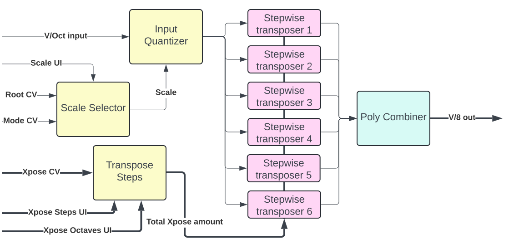

# Squinktronix Harmony II manual

## What it does

At the simplest level, Harmony II will take a monophonic CV input and output a polyphonic CV containing a chord. All of the controls, CVs, etc. will control exactly what chord comes out.

Harmony II is a chord generator with a trick - it can generate the correct chords for the key that you set. For example, in the key of C Major, the triads in the key are C Major, D minor, E minor, F Major, G Major, A minor, and B diminished. Harmony II can generate this easily.

Many of Harmony II's features are motivated by use of diatonic harmony. But Harmony II also had non-diatonic scales.

Because use of diatonic scales and harmony is the "primary use case" of Harmony II, sometimes the terminology or parts of the manual may make is sound like Harmony is limited to diatonic harmony. This is emphatically not the case.

## TL;DR

To quickly get Harmony II working, connect a monophonic pitch source to the V/Oct input. The chord output will come out the V/Oct output. Pick a key signature, load up a preset, and you are off.

Or, instead of loading a preset, select one or more generator units with the push-buttons on the left. For those generators, pick a number of steps to transpose.

## Why diatonic aware modules are interesting

Much common music uses some form of diatonic harmony. For some typical examples, consider the chord progressions for some common songs. Bob Dylan's ["All Along The Watchtower"](https://www.youtube.com/watch?v=bT7Hj-ea0VE). The chords are A minor, G major, F major. Those are the diatonic triads on 8, 7, 6 in A Minor. Or [every teen-age car-crash song](https://www.youtube.com/watch?v=bh4se9YMV3A) is G major, E minor, C major and D major. Those are the diatonic triads on 8, 6, 4, 5 in G major.

Many chord generators tend to generate all the chords at different pitches, like C Major, D Major, etc... Many chord generators are unable to generate the diatonic chords at different pitches, or at best you need two of them, be able to control their rounding, and know how to do the scale arithmetic yourself.

Harmony II also has a bunch of non-diatonic scales in it. So it isn't limited to diatonic harmony at all.

For more on scales and modes and such, look at [more on harmony](./more-on-harmony.md).

Aside from generating "in key" triads, like the examples above, you can also use harmony to generate a single parallel interval. This is usually done with a third, or inverted third. Some common rock examples are [The Beatles: And Your Bird Can Sing](https://www.youtube.com/watch?v=sOUlbredoUM), the intro to [Bon Jovi's Wanted Dead or Alive](https://www.youtube.com/watch?v=SRvCvsRp5ho), [The Beatles: Blackbird](https://www.youtube.com/watch?v=Man4Xw8Xypo), [Van Morrison's Brown Eyed Girl](https://www.youtube.com/watch?v=kqXSBe-qMGo)

If you are interested, the links above take you to YouTube videos featuring the songs in question.

## Historical note

The diatonic scales, and the ability to transpose in a scale comes from a small part of the Harmony module. Dedicated Squinktronix users might note that Harmony only showed the diatonic scales. Where do the other scales in Harmony II come from? Simple answer - all of this came from Seq++, which has all those scales and can transpose in key. Very little was added to that - so most of the work for Harmony II is in details of polyphony and CV control.

## Testing and Hacking

The Impromptu Four View module is really handy for seeing what is being generated by Harmony II. And, as always the VCV 8vert is a handy way to generate test control voltages. You may already have modules you use for these things, but if not, here is a picture of my test setup:

## Presets

The provided presets are all things that could be set up quite easily from the panel of Harmony II. They are mainly provided as examples.

In many cases, the presets use the key of C minor - which is said to be the most commonly used key in VCV Rack. Feel free of course to move them wherever you would like.

The presets are grouped by type. The first group are the triads. A triad is a very commonly used chord. The presets are:

* **triad**. This is a root position triad. A very useful basic "chord".
* **triad first inversion**. This is the same triad, but with the root raised an octave, to make the lowest pitch the third. This is often called a "close position" voicing of the triad in first inversion.
* **triad second inversion**. This is the same triad, but with the root raised an octave and the third raised an octave, to make the lowest pitch the fifth. This is often called a "close position" voicing of the triad in second inversion.

The next group are the parallel intervals. There are just two notes - the note you input, and a second note the the specific interval.

* **parallel third**. A very common interval often used for "harmony guitar" in old rock songs. A note transposed up a third is added.
* **parallel sixth**. A note a sixth above the input is added.
* **parallel third inverted**. The a note a third lower than the input is added.

## Panel controls, per transposer

**Enable**: there are six transposers in Harmony II. They are only active if enabled. If you want to output a three note chord, for example, enable three of them.

**Transpose Degrees**: This is the main control for each transposer. This sets by how many scale degrees each transposer will transpose. So, to transpose by a third, set this to +2 (since a third is up two scale degrees from the root).

**Transpose Octave**: Each transposer will transpose by the number of octaves entered, plus the number of degrees. So, in a diatonic scale, one octave and four degrees will transpose up an  octave and a fifth.

## Global panel controls

**Key signature root**: Where the scale starts. For example, if you want to be in C, set this to C.

**Key signature mode**: What are the notes in the scale.

## CV inputs

**V/Oct** is the main CV input. It is monophonic and follows the VCV standard for pitch. All of the output notes will track this pitch.

**CVO** is the output. It is polyphonic and follows the VCV standard for pitch. This is where the quantized and generated pitches come out.

**Key** will set the Key signature root. It is monophonic, and also follows the VCV pitch standard in that each setting is 1/12 of a volt from the other adjacent setting.

**Mode** will set the Key signature mode. It is monophonic, and puts a different scale every 1/12 volt. So it's similar to the VCV pitch standard, but not really.

**XP** transpose amount. It is polyphonic, does not follow the VCV pitch standard. It is one "step" per 1/12 volt, but a scale step is not the same as a semitone.

**PES** key signature input. It is polyphonic and follows the "Poly External Scale" (PES)
 protocol developed by Aria Salvatrice. It allows the key and mode of Harmony II to follow the key and mode of any module that can output this protocol.

There are a few things to remember with these CV inputs.

The mode input can be confusing. There is a new scale every 1/12 volt. The number of scales depends on the setting in the context menu for "Mode CV only diatonic". If it is only diatonic scales, then there are 7 scales so:

* 0 = Major
* 1/12 = Dorian
* 2/12 = Phrygian
* 3/12 = Lydian
* 4/12 = Mixolydian
* 5/12 = Minor
* 6/12 = Locrian
* 7/12 = Major (again)
* -7/12 = Major (again)

But, when all scales are enabled:

* 0 = Major
* 1/12 = Dorian
* 2/12 = Phrygian
* 3/12 = Lydian
* 4/12 = Mixolydian
* 5/12 = Minor
* 6/12 = Locrian 
* 7/12 = MinorPentatonic
* 8/12 = HarmonicMinor
* 9/12 = Diminished
* 10/12 = DominantDiminished
* 11/12 = WholeStep,
* 13/12 = Chromatic

## V/Oct output

This is the polyphonic output where the quantized and generator pitches are output. It follows all VCV standards for pitch CV.

## Context menu items

**Mode CV only diatonic**. Controls whether the Mode CV can select any scale, or just select a diatonic scale. All other parts of Harmony II will ignore this setting, so you are free to pick any scale from the the dropdown on the panel.

**Sharps and flats**. Some pitches may be displayed either as a sharp or a flat. For example A sharp and B flat are the same note. So this setting controls how Harmony II makes a decision. In many cases Harmony II can pick one of these as the default. It almost always does this by picking the choice that will give the least number of accidentals in the key signature and always avoiding "crazy" key signatures. So, for example, it will pick flats for C minor, which contains C, D, E flat, F, G, A flat, and B flat. Spelled with sharps it would be C, D, D#, F, G, G#, A#, C. The problem with the sharp interpretation is that is has both the natural and the sharp for D and G, which would make it very difficult to notate using standard music notion.

For non-diatonic scales, Harmony II may have no default.

* Default+sharp. In this setting harmony II will pick a display mode. If it can't determine a default, it will use sharps.

* Default+flat. In this setting harmony II will pick a display mode. If it can't determine a default, it will use flats.

* Sharps. Harmony II will always use sharps.

* Flats. Harmony II will always use sharps.

## PES format

As mentioned above, Harmony II supports the PES protocol. This allows fully key signature information to be passed between modules supporting this protocol.

As an output, Harmony II will output whatever it is set to.

As an input, PES is a little more complex. Harmony II will examine what is on the PES input. It it maps to a scale that Harmony II knows about, Harmony will follow this input. If the input is for a scale that Harmony II does not support, the a small red LED will illuminate next to the KSI input to show an error.

More information on PES may be found [here](./pes.md).

## When multiple inputs fight over key signature

There are three different ways to set the key signature:

* Through the UI.
* Via the PES input.
* Via the key/mode CV inputs.

If any of there are used, and disagree, then Harmony II will resolve the conflict. For example, what happens if both PES and Key CV are used at the same time? Well, the short answer is that you shouldn't do this. The more complete answer is that whichever changed most recently will "win".

## Demo patch

A very basic demo may be found [here](./harmonyII-demo.md)

## Block diagram

