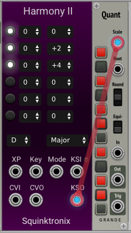
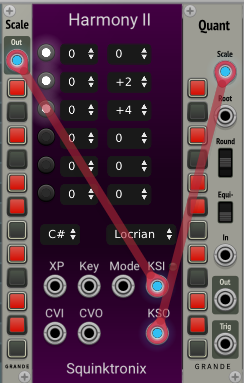

# Polyphonic External Protocol

Polyphonic External Protocol, or PES, is a protocol developed Aria Salvatrice that allows scale information to be carried on a single cable between different VCV modules that support this protocol.

Here is a simple example where the Squiktronix Harmony II is setting the scale for Grande Quant:

One reason that PES is possible is that is is limited to 12 note scales that repeat each octave.

PES is a VCV connection carrying 12 channels. The twelve channels correspond to the twelve notes, starting with C on channel 0 and going up to B on channel 11.

For each channel the voltage will be 0 volts for a note that is not in the scale, 8 volts for a note that is in the scale, and 10 volts for the root of the scale.

Here is a screen capture of a C Major scale, Where Grande Scale is setting the scale, Harmony II is following, and Grande Quant is following Harmony II:

As of this writing, the VCV 2.x Modules that I know of are:

* **Squinktronix Harmony II**. KSO Output is fully compliant. KSI input is compliant, but if the signal on the input does not correspond to a scale that Harmony II knows about, it will show an error, and ignore the input.

* **Grande Quant**. The Scale input accepts a PES signal, and will display it. Since a quantizer doesn't know or care what the "root" is, the root (10 volts) is treated like any other note in the scale.

* **Grande Scale.** The output is a PES signal. Again, since Scale doesn't know or care about root, it is not sent.

* **PurrSoftware Meander**. Provides PES output.
