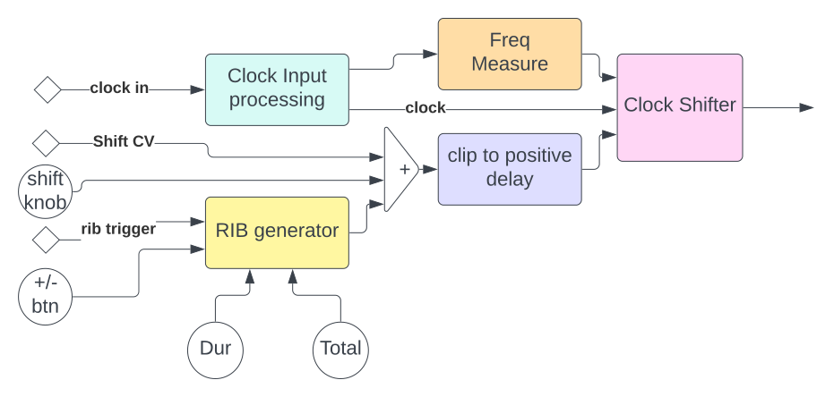

# Squinktronix Phase Patterns manual

This module is under test at the moment. This means:

* The panel is not finalize.
* The feature set will change.
* The patch format may change, such that patches saved with this module may not load correctly in future versions.
* There are probably bugs and limitations.

## What it does

Phase Patterns is very simple - it takes an input clocks and delays it. The delay is in metric units, not absolute time. So, when the input clock rate changes, so does the shift amount. Here is a simple example:

* Regular clocks running into the clock input.
* Shift set to .5.

The output clock will be at the same rate (tempo) as the input clock, but it will be delayed by half a clock. If the clocks are perhaps quarter notes, the output will be shifted/delayed by an eighth note.

There is also a built in shift generator that will over the course of 'n' clocks delay the output by 'm' clock. This is referred to as the "RIB generator", for "Reich In a Box", the original name of the modules.

There are many, many uses for this clock shifter, and most can be "unlocked" by feeding clever signals into the shift CV input.

Also, the module is fully polyphonic, so there is great potential for signal mangling.

## Possible uses

Used as a simple metric delay, it will add an offset clock that can be adjusted to be a "swing" or an echo.

If the delay is slowly changed during playback, "phasing" effects can be easily introduced (and controlled!) as in the music of Steve Reich. Some of that is explained [here](https://en.wikipedia.org/wiki/Piano_Phase). Note that the name of this module is in fact borrowed from the name of a Reich composition. A review of that recording can be found [here](https://pitchfork.com/reviews/albums/21584-four-organs-phase-patterns/).

Please remember that there are many potential uses of this module - recreating the compositions of Steve Reich is just one of them.

## Panel

The various controls and displays are all to compute and modulate the shift amount, and to display the shift amount. We use an arbitrary convention here that 1.0 is the duration of a clock, and that positive numbers mean a delay. so shift = .25 would delay by a quarter of a clock. Shift 2.5 would delay by two clocks and a half. If the delay is negative then the output clock will "advance" by the shift amount. This 0.0 to 1.0 range would be 0 to 2*pi in radians, or 0 to 360 degrees in cartesian coordinates.

The RIB controls are labeled "Total" and "Dur". The total control is the total amount of shift that will be applied when the RIB generator hits its max value. The "Dur" control is how long it takes to get there. So, if Dur is one, and Total is four, then each RIB will over the course of four clocks shift by one clock.

The buttons labeled "+" and "-" will trigger the RIB generator. + for a slowly increasing delay, - for a slowly increasing lead. The buttons will light up when the RIB generator is moving.

The controls on the front panel are monophonic, and will affect all delay channels. More on polyphony later.

Next to the shift controls is a display that shows the current shift amount being applied. The shift amount is basically the sum of the shift knob, the shift control voltage, and the output of the "RIB generator". If you are using polyphony such that there are multiple RIB generators, then this display will just show the total delay for the first channel.

### The inputs

Clock input. This is the clock that Phase Patterns will lock onto and delay. It follows the VCV standard - any input above 1.0 is treated as a high clock, and any input below .1 is treated as a low clock. In practice this means you can run most anything into it.

Shift amount input is combined with the other shift inputs to give the final shift amount. Here 0v is "no shift", 5v is "shift of one", which as explained above is one clock. Negative voltages will apply a negative shift.

### The outputs

Clock output is the only output of the module. If follows the VCV recommendations where output low is 0, output high is 10. It is of course polyphonic.

### The controls

Shift amount is a fixed shift that is added to the other shift sources. It currently has a range of 0..4.

The RIB buttons (labeled "+" and "-") trigger a new varying shift cycle when they are pressed. This causes an LED to go on and the shift will start to change. Once the RIB generator get to the end ("Total), it stops and the led goes off.

### More about what is going on inside

As you can see in the block diagram, there is not a ton going on inside this module.

A key thing to observe, however, is that there are only three or four CVs going into the module: shift, RIB trigger (+,-), and clock in. These are the three inputs that can force Phase Patterns to be polyphonic. The polyphony of the clock output is always the greatest of the polyphony of the CV inputs.

When Phase Patterns had a polyphony of "n", there are always "n" clock shifters. When the input clock is polyphonic, then there are "n" clock processing units. When and of the RIBs inputs is polyphonic there will be "n" RIBs generators.

Notice also to block that wraps the delay into the 0..1 range. The clock shifter itself only understands delays in this range.

You can also see that there is a frequency measure in between the clock and the shifter. The shifter needs to know the input frequency so that it can interpret [0..1] as [0..full] period.

### More about delay and advance

[TBD]

### More about polyphony

because any of the input can be monophonic or polyphonic, and because Phase Patters is kind of odd anyway, the polyphonic possibilities are be a litte difficult to understand. Here are a couple of "simple" configurations for illustration.

#### All inputs mono except clock in is n voice polyphonic

The clock output will have n voices. There will be n clock shifters, but only one RIB generator.

In this configuration, each clock in to clock out will be independent, but they will all share the shift knob, the shift CV input, and the RIB generator.  If the different clock inputs are all at different rates, the outputs will be, too. Since the shift in each will be a fraction of a clock, the absolute shift (in seconds) will be different for each.

If the RIB generator is triggered, it will affect all the clock shifters the same. Sort of.

#### All inputs mono except shift input is polyphonic

In this case a single mono clock will got to n clock shifters and end up as a poly clock output. Each channel will have its own shift, so each output will be at the same rate as the input clock, but each will be shifted by a different amount.

#### All inputs mono except rib trigger input is polyphonic

### More about the clock shifter

Take away some of the features, and Phase Patterns is basically a clock shifter. In this particular case what it wants to do is output a single clock for every input clock, but delayed by some fraction of a clock period. It is not a delay line, so you can't use it as an echo effect.

Because it only outputs a single clock for each input clock, and wants to know the input frequency of the clock, it behaves very predictably with a steady repeating clock. With a near random input, it's uncertain what would come out.
