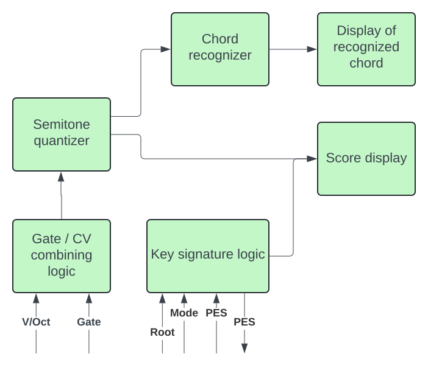

# Squinktronix Visualizer manual

## What it does

Visualizer is a simple module, and really does one thing. It looks at incoming pitch data, and tries to determine what chord that corresponds to.

Visualizer also displays the input in standard music notation, but that is really a secondary function of the module. The notation display and controls may be completely ignored if you wish.

When identifying chords, Visualizer doesn't care what octave a chord is in, or which channels the pitches are in. So, for example, E2, G7, C5 is still a C Major chord. Also, duplicates/doublings are ignored, so C, E, G, C is recognized as C Major, but C, E, G, A is not.

While some of the name of the chords may come more from the classical world, it's useful for lots of tonal music. Some people may call chords by different names, but usually the translation isn't too bad. An example: we call (G C E) "C Major, second inversion" - others might call it "C over G". But most people know it's the same thing.

Well, Visualizer actually does two things. It can output the root of the recognized chord as a CV.

## Latest test release

The current test release has much improved enharmonic spelling, but it's still not perfect. A know issue is that it can sometimes mis-spell a perfect fifth. The current "rules" are documented below.

The display of overlapping notes and accidentals is much improved. While the placement of accidentals is not always "correct", any cases that are illegible due to overlapping accidentals is a bug.

The root and "root valid" outputs are new. There is currently a delay of up to 32 samples for this output. We might want to come up with something better.

The context menu entry for Sharps&Flats is new.

The panel is wider now.

Bugs with unplugging cables, and enharmonic spelling of the identified chord are fixed.

## Notes for testers

It would definitely be a bug it a chord is mis-characterized. If it say something is a C Major it should be that. Also if an inversion is displayed it would be a definite bug to be fixed if the information is incorrect.

Some things about chord identification and spelling are more ambiguous, and subject to personal style. For example the chord C, E, G, B flat is often called "C7". But it is also called the dominant seventh. But if you find that the naming of some of these chords is correct, but strange to you, that may very well be something that should change.

The "transcription" of the input to standard music notation. Even though it's just "eye candy" it's supposed to be legal. So in any case that's remotely tricky, like clusters of notes, the resulting display should always be legal, and correspond to the pitches coming in. In a lot of cases it won't look nearly as good as you could expect a hand-written score to look. But it's a fixable bug if it's just plain wrong.

## Using Visualizer

It can be as easy a patching a CV into the V/Oct input. If recognized, the input chord is identified in text in the middle of the panel. And the chord will be displayed in standard music notation. The CV input must be polyphonic to be able to carry a chord.

## Reference

### Chords recognized by Visualizer

(Examples below in C, but of course they are recognized at all roots)

- C Major : C, E, G
- C minor : C, E flat, G
- C Diminished : C, E flat, G flat
- C Augmented : C, E, G sharp
- C Sus2 : C, D, G
- C Sus4 : C, F, G

- C Seventh : C, E, G, B flat
- C Major Seventh: C, E, G, B
- C minor Seventh: C, E flat, G, B flat
- C mM Seventh: C, E flat, G, B

Ninth chords are recognized with the fifth present, or not:

- C Ninth : C, E, [G], B flat, D
- C MajorNinth : C, E, [G], B, D
- C minor Ninth : C, E flat, [G], B flat, D
- C mM Ninth : C, E flat, [G], B, D

Note that all recognized chords have a perfect fifth, and ninth chords are only recognized if the 9th is a major second.

### CV I/O

V/Oct: Polyphonic pitch input that follows the VCV standards. This is the main input.

[Gate]: polyphonic gate input. Does not need to be hooked up. If it's unconnected, than Visualizer will look at all the pitch channels in the input. If [Gate] is patched, then Visualizer will only look at pitch channels that have their gate active. This could be useful if you are looking at the pitches coming from the VCV MIDI CV module, for example.

PES Input, and PES output. Useful when used with other modules that support PES. Any signal coming into the PES input will control Visualizer's key signature. And Visualizers key signature will be sent to the PES output. You can find more on PES [here](./pes.md)

Root: Outputs the pitch of the root of an identified chord. If the chord is not identified, it will continue to output the last voltage output.

VLD: a gate output that is high when the root output is "valid", i.e. when the chords coming in is recognized. Output is 10v when true, 0v when false.

### Controls

Key Root, Diatonic Mode: this control mainly affect the music notation displayed at the top. They do not affect chord recognition at all. They do set the key signature for the transcription. They also can have an effect on enharmonic spelling of the name of the recognized chord.

### Context Menu

Sharps&Flats: controls whether a sharp or a flat is used (by default) for a note or a key signature name. There are four setting:

- Default + sharps: In a key that is a "sharp key", like G Major, sharps are used. In a flat key, like C Minor, flats are used. If there is a tie (only possible in C Major), then sharps are used.
- Default + flats: follows the key, as described above. If there is a tie or ambiguity, flats are used.
- Sharps: sharps are always preferred.
- Flats: flats are always preferred.

## More about enharmonic spelling

As noted above, enharmonic spelling is mainly an issue with the displayed music notation. It also can affect the naming of identified chords. For example C sharp Major and D flat major are the same chord, but the spelling of the name is different.

In general, the enharmonic spelling will tend to follow the Sharps/Flats preference. So in a "sharps" key note will tend to be spelled with a sharp. But there are many cases when this would give terrible results. So visualizer followed the following rules:

- It knowns that F is E sharp, for example.
- It does not know how to use double sharps or double flats.
- It prefers to avoid two notes on the same leger line (so it prefers C, D flat to C C sharp, even in a "sharp" key).
- It strongly prefers that major and minor thirds be two lines apart.
- It prefers notes that are in the key to accidentals.
- It prefers "matching" accidentals (sharps in a sharp key, flats in a flat key).

### More about accidental placement

Visualizer tries to draw accidentals and notes so they don't touch each other, which is very difficult to read. But Visualizer does not try to place things perfectly - so the results should be legible, but may not be "engraving quality".

## Visualizer block diagram

